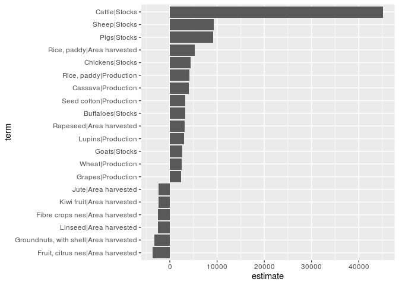
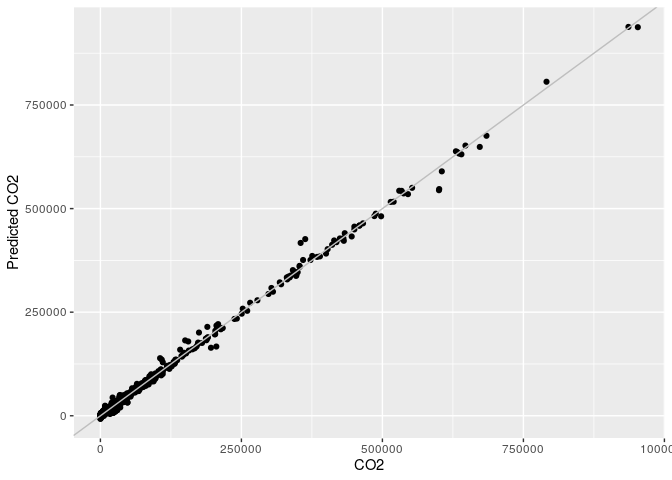
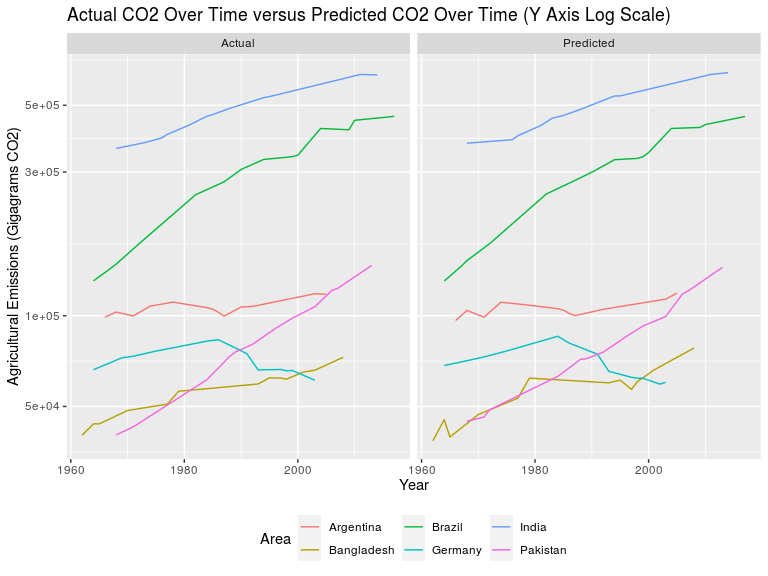

Predicting Agricultural Emissions
================

  - [Background](#background)
  - [Question](#question)
  - [Dataset](#dataset)
  - [Modeling](#modeling)
      - [Data](#data)
      - [Model](#model)
      - [Validation](#validation)
  - [Conclusion](#conclusion)

## Background

Global warming is one of the primary global problems we face today. The
world is heating up at an unprecedented rate due to emissions produced
by human activity, and we are quickly reaching a point of no return. Of
all emissions produced globally, about 11% can be attributed to
agriculture (1). While not as impactful as something like
transportation, which makes up over 30% (1), cutting emissions in any
sector can make a difference.

Agricultural greenhouse gas emissions come from several sources; the
three primary ones are agricultural soil management, enteric
fermentation, and manure management:

  - Agricultural soil management: “Nitrous oxide is produced naturally
    in soils through the microbial processes of nitrification and
    de-nitrification.” (2)

  - Enteric fermentation: “Methane is produced as part of the normal
    digestive processes in animals. During digestion, microbes in the
    animal’s digestive system ferment feed. This process, called enteric
    fermentation, produces methane as a by-product which can be emitted
    by the exhaling and belching of the animal.” (2)

  - Manure management: “Methane is produced by the anaerobic (without
    oxygen) decomposition of manure. When manure is handled as a solid
    or deposited naturally on grassland, it decomposes aerobically (with
    oxygen) and creates little methane emissions. However, manure stored
    as a liquid or slurry in lagoons, ponds, tanks or pits, decomposes
    anaerobically and creates methane emissions.” (2)

## Question

**Can we predict a country’s agricultural emissions given the raw
agricultural and livestock production of the country that year?**

When doing background research, we noticed that the processes that
result in agricultural emissions are pretty direct. Fermentation of
Nitrogen sources in the agricultural soils leads to Nitrous oxide being
produced. This can be reframed as: the more crop farming we do, the more
Nitrous oxide release we get (as they are directly related). Enteric
fermentation is also directly related to the process of livestocks’
digestive systems. So, the more livestock we have, the more Methane we
have released into the environment as a result of enteric fermentation.
The same idea applies to manure management. If these processes are so
directly related to the release of emissions and global warming, we
should be able to predict agricultural emissions from data of
agricultural and livestock production.

## Dataset

We found the FAOStat database (3), which is curated by the Food and
Agriculture Organization of the United Nations (FAO). The FAOStat
database aggregates many smaller datasets on various specific metrics as
related to worldwide agriculture. Of these subsets, we selected the
datasets on crop production, live animals and agricultural emissions.

From the datasets we chose, we attain area harvested, yield, and
production quantity of 129 types of crops and the amount of stock of 14
types of livestock for 225 countries over years 1961 - 2017. The
agricultural emissions dataset also gives us access to the amount of CH4
and N2O emissions for these years and countries, each of which we
convert to terms of gigagrams of CO2 then combine. We link the different
datasets through year and country, with the goal of predicting the CO2
emissions using the crop and livestock data.

``` r
df_all_na <- read_csv("./data/processed/combined_total_na.csv")
```

For uncertainty, because our data is collected of our sample size (the
world) and is not representative of a larger sample size, then we can
say that there is no uncertainty because there is no sampling.

## Modeling

### Data

To start, we process this data so that each observation consists of the
raw agricultural output and CO2 emissions due to agriculture of a
country for a given year. NA values were replaced by 0s, as they tended
to indicate that a country didn’t produce any of the given produce that
year, and aggregate columns (like Goat and Sheep) were discarded in
favor of their individual components. We also identified a list of
`Area`s that grouped multiple countries and removed them. This included
China, as it is broken down into 4 major sections that otherwise exist
in the dataset. Finally, we removed rows where the CO2 emissions were 0,
as this means there were no recorded emissions.

``` r
# List of areas that (usually) aren't actually countries
areas_bad = c("World", "Americas", "Asia", "Australia and New Zealand", "China", "Central Asia", "Central America", "Eastern Africa", "Eastern Asia", "Eastern Euorpe", "Europe", "Land Locked Developing Countries", "Least Developed Countries", "Low Income Food Deficit Countries", "Middle Africa", "Net Food Importing Developing Countries", "Northern Europe", "Northern Africa", "Northern America", "Pacific Islands Trust Territory", "Southern Asia", "South America", "Southern Africa", "Small Island Developing States", "Serbia and Montenegro", "Western Asia", "Western Africa")
df_processed <-
  df_all_na %>%
  rename(CO2 = `Agriculture total|CO2`) %>%
  select_if(~ !is.logical(.)) %>%
  replace(is.na(.), 0) %>%
  select(-contains("and")) %>%
  filter(CO2 != 0) %>%
  filter(!(Area %in% areas_bad))
```

Next, we split the data into the train set and the hold-out test set.

``` r
set.seed(42)
emissions_split = initial_split(df_processed, prop = 0.8)
emissions_train = training(emissions_split)
emissions_test = testing(emissions_split)
```

Then, we define several pre-processing steps. First, we drop the `Year`
and `Area` columns as they are not inputs we want the model to use. We
also remove columns with zero variance then standardize the variables to
have a mean of 0 and a standard deviation of 1. Both steps are important
for fitting a lasso regression model.

``` r
emissions_rec <-
  recipe(`CO2` ~ ., data = emissions_train) %>%
  step_rm(Year, Area) %>%
  step_zv(all_numeric(), -all_outcomes()) %>%
  step_normalize(all_numeric(), -all_outcomes())

emissions_prep <-
  emissions_rec %>%
  prep()
```

### Model

For the modeling portion, we decided to use lasso regression. As we had
a large amount of inputs, we wanted to leverage lasso regression’s
property of pushing coefficients to 0 in order to have a more tractable
end model. To start, we define our model with a naively chosen penalty
of `0.1` then fit on the train set to get a sense of performance.

We visualize the coefficients of the model with the largest magnitude to
get a sense of what the model values in the prediction process. Seeing
cattle as the greatest factor is encouraging - we know from other
research that cattle greatly contribute to multiple types of emissions.

``` r
df_coeff %>% 
  mutate(
    term = fct_reorder(term, estimate)
  ) %>% 
  arrange(desc(abs(estimate))) %>% 
  filter(term != "(Intercept)") %>%
  head(20) %>%
  ggplot(aes(
      x = estimate,
      y = term
    )) +
  geom_col()
```

<!-- -->

We then sweep across a range of L1 penalty parameters on our train set
to determine the setting that minimizes root mean squared error on our
data.

### Validation

The chosen penalty is used to fit a model on our train set to create our
final model. We evaluate the final fit on our test set to see how the
model performs on data that it has not seen during training. Here, we
achieve a r-squared of about `0.0027`. Note that tidymodels seems to
have 1 as the best possible outcome for r-squared, so we manually
adjust. Given that this r-squared value is small, we believe that we
have a strong model for predicting agricultural emissions.

``` r
final_fit <- last_fit(
  final_lasso,
  emissions_split
)

final_fit %>%
  collect_metrics() %>%
  select(-.config, -.estimator) %>%
  filter(.metric == "rsq") %>%
  mutate(.estimate = 1 - .estimate) %>%
  rename("Metric" = .metric, "Estimate" = .estimate)
```

    ## # A tibble: 1 x 2
    ##   Metric Estimate
    ##   <chr>     <dbl>
    ## 1 rsq     0.00269

However we have not addressed the largest source of uncertainty in our
process - the random train / test split. To account for this, we apply
10-fold cross validation on our train data which allows us to quantify
how our model’s performance might vary based on the initial split. We
use the produced matrix to make a 95% confidence interval of about
`0.0024 - 0.0046` for r-squared. Given that the high end of the
r-squared interval is still low and the overall range of the interval is
relatively speaking small, we believe that the train / test split does
not significantly affect the performance of our model.

``` r
set.seed(44)
folds <- vfold_cv(emissions_train, v = 10)
confidence_level = 0.95

results <-
  fit_resamples(
    final_lasso,
    folds
  ) %>%
  collect_metrics()

stat <- results %>% filter(.metric == "rsq")
lo <- pull(stat, "mean") - qnorm( 1 - (1 - confidence_level) / 2 ) * pull(stat, "std_err")
hi <- pull(stat, "mean") + qnorm( 1 - (1 - confidence_level) / 2 ) * pull(stat, "std_err")
cat("95% Confidence Interval for r^2\n", "Lower bound:", 1 - hi, "\n", "Upper bound:", 1 - lo)
```

    ## 95% Confidence Interval for r^2
    ##  Lower bound: 0.002380999 
    ##  Upper bound: 0.004641898

As a final validation step, we produce two graphs. The first is a graph
of the predicted CO2 versus the actual CO2 for all observations in our
test set. Here, we note that the majority of points lie around the line
y = x, which means that the models predictions are close to the actual
value for many of the observations in the test set.

``` r
predictions <-
  collect_predictions(
    last_fit(
      final_lasso,
      emissions_split,
    )
  ) %>%
  pull(".pred")

emissions_test %>%
  mutate("Predicted CO2" = predictions) %>%
  ggplot(aes(CO2, `Predicted CO2`)) +
  geom_point() +
  geom_abline(intercept = 0, slope = 1, color = "grey")
```

<!-- -->

The second is a graph of the actual CO2 for a set of countries over time
next to the predicted CO2 for the same set of countries over time. We
filter for countries with more than 10 data points in the test set and
exclude the many countries with a small amount of emissions to make a
clearer graph. This does potentially ignore issues that we might have in
predicting low emission countries, but considering we have validated our
results several ways we believe this is alright. Looking at the graph,
it is clear that the general shape of the emissions over time for both
predicted and actual CO2 are very similar.

``` r
emissions_test %>%
  mutate("Predicted CO2" = predictions) %>%
  filter(CO2 > 50000) %>%
  group_by(Area) %>%
  filter(n() > 10) %>%
  ungroup() %>%
  pivot_longer(
    cols = c("CO2", "Predicted CO2"),
    names_to = "metric",
    values_to = "value"
  ) %>%
  ggplot(aes(x = Year, group = Area, color = Area)) +
  geom_line(aes(y = value)) +
  theme(legend.position = "none") +
  facet_wrap(~ metric)
```

<!-- -->

## Conclusion

To conclude, it seems that we can indeed predict agricultural emissions
given the raw agricultural and livestock production of the country that
year. Although we used country and year to link the different datasets,
that was for the sole purpose of linking the datasets; our model works
independent of country and year, with raw agricultural and livestock
production as the only necessary inputs to accurately predict
agricultural emissions.

We believe our is a strong predictor as we have conducted multiple
validation metrics that, all of which it has performed well on. Our
first was an evaluation on our held-out test set, with a low r-squared
value of 0.0011163. We also conducted 10-fold cross-validation on our
training set, creating out train / test split 10 ways, and taking a
confidence interval of our r-squared calculated from each sample. This
produced a 95% confidence interval for r-squared of 0.0008895 -
0.0012233, which again indicates a strong model. Our final two metric
were more qualitative; we plotted our predictions to see if they matched
the actual data. In our first graph, we found that the predicted CO2 and
actual CO2 tracked, following the line of `y = x`. For our second graph,
we presented the same data from the first graph but in a more visually
intuitive manner. We produced two graphs of predicted and actual CO2,
plotting each value over time with each country as a line. Since our
model operated only on raw data of raw agricultural and livestock
production without the year or country identified, the fact that we see
similar trends in countries over time further validates our model.
